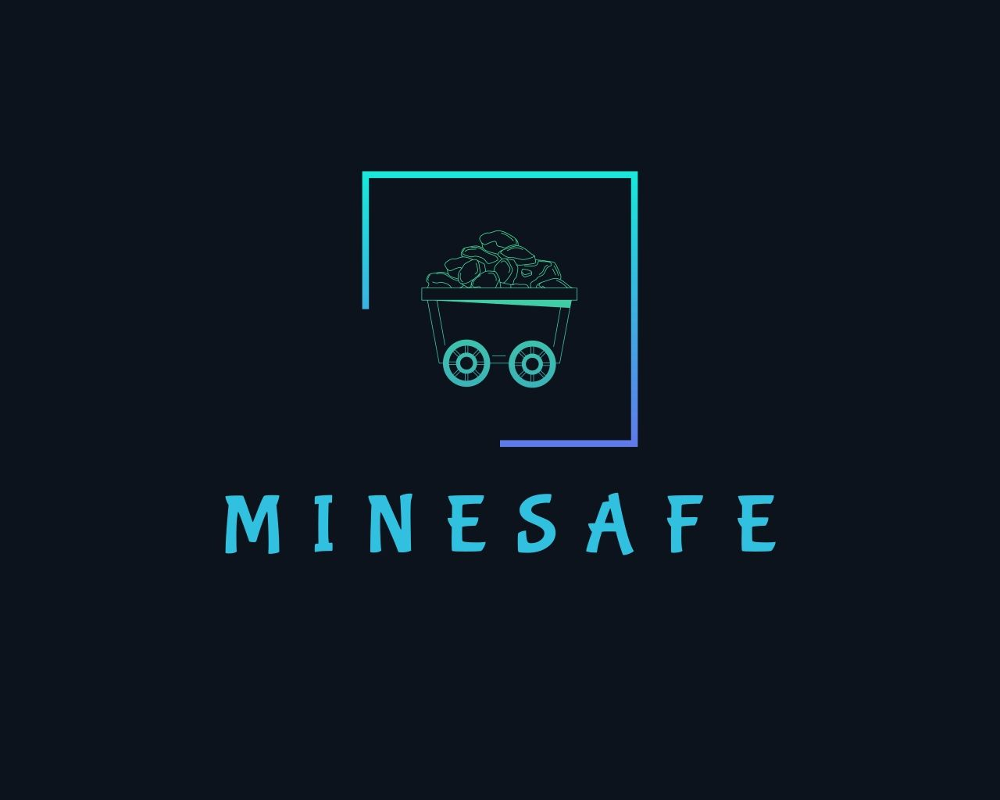

#  MineSafe 
MineSafe is a specialized Progressive Web Application (PWA) designed to enhance the safety and operational efficiency of mine workers. By providing role-specific safety checklists, DGMS (Directorate General of Mines Safety) rules, and multi-language first aid guides, it ensures that critical, life-saving information is always accessible—even in remote locations with no internet connectivity.

---

## 🚀 Live Demo
Access the application here:

https://gleeful-khapse-18d858.netlify.app/

---

## ✨ Key Features
-  **Role-Based Safety Modules**: Tailored checklists and DGMS rules for 25+ specific mining roles, from Drillers and Blasters to Mine Managers.

-  **Multi-Language Accessibility**: Fully localized UI and content in 11 languages: English, Hindi, Bengali, Marathi, Telugu, Tamil, Gujarati, Urdu, Kannada, Odia, and Malayalam.

-  **Intelligent Voice Assistant**: Hands-free navigation and command execution using the Web Speech API, allowing workers to access rules while their hands are busy.

-  **Advanced SOS System**: A robust emergency response tool that triggers direct calls or sends SMS alerts containing the user's name, role, and precise GPS location via Google Maps links.

-  **Offline-First Functionality**: Built as a PWA with dedicated Service Workers to cache assets, ensuring 100% functionality in deep underground mines or areas with poor cellular reception.

-  **Educational Content**: Integrated safety "Shorts" and a "Video of the Day" to promote continuous safety awareness among staff.

---

## 🛠️ Technology Stack
-  **Frontend**: HTML5, CSS3 (Modern dark-themed UI with Roboto Mono).

-  **Logic**: Vanilla JavaScript (ES6+).

-  **PWA**: Web Manifest and Service Workers for offline capabilities.

-  **APIs**: Web Speech API (Recognition/Synthesis) and Geolocation API.

---

## 🆘 Emergency SOS Usage
-  Click the SOS button in the header.

-  Choose **CALL** for immediate voice contact with the emergency supervisor (Number).

-  Choose **MESSAGE** to auto-generate a distress SMS. The app will fetch your GPS coordinates and draft a message with your identity and location for immediate rescue.
